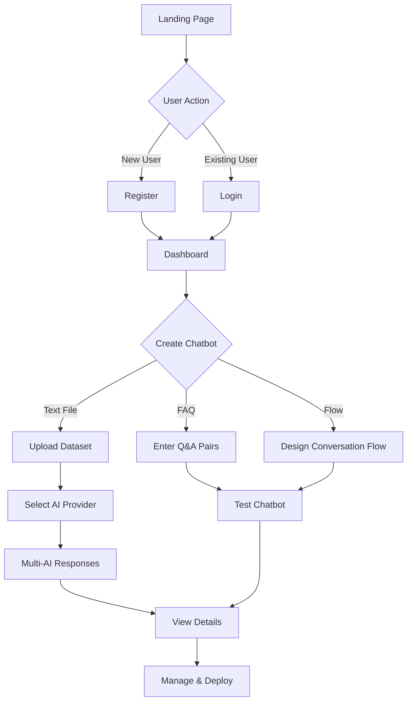

# 🤖 AI ChatBot Application

A sophisticated Django-based multi-AI chatbot platform that allows users to create, manage, and deploy intelligent conversational agents with multiple AI backend support.


## ✨ Features

### 🎯 Multiple Chatbot Types

- **📄 Text File Based Bot**: Train chatbots using your business data from TXT, CSV, or PDF files
- **❓ FAQ Bot**: Create form-based chatbots with predefined question-answer pairs
- **🔄 Flow Based Bot**: Design interactive conversational flows with branching logic

### 🤖 Multi-AI Support

Integrate with multiple AI providers for diverse responses:
- **Meta AI** (via Groq)
- **OpenAI** (GPT models)
- **Google Gemini**
- **Anthropic Claude**

### 💼 User Management

- Secure user authentication and registration
- Personal dashboard for each user
- Manage multiple chatbots per user account

### 📊 Analytics & Insights

- Track chatbot interactions
- View conversation history
- Monitor usage statistics
- Detailed chatbot performance metrics

---

## 🏗️ Project Architecture

```
ChatBotApp/
├── 🎨 Frontend Layer
│   ├── templates/           # HTML templates with Bootstrap 5
│   │   ├── dashboard.html   # User dashboard
│   │   ├── chatbot_detail.html
│   │   ├── text_file_based.html
│   │   ├── Form_Based/      # FAQ bot templates
│   │   └── Flow_Based/      # Flow bot templates
│   └── static/              # CSS, JS, and assets
│
├── ⚙️ Backend Layer
│   ├── views.py             # Core business logic
│   ├── models.py            # Database models
│   ├── forms.py             # Form handling
│   └── urls.py              # URL routing
│
├── 🗄️ Database Layer
│   ├── models.py
│   │   ├── Chatbot          # Main chatbot model
│   │   ├── ChatbotInteraction  # Conversation history
│   │   ├── Question/Option   # Flow-based bot structure
│   │   └── SelectedBot       # AI provider selection
│   └── migrations/          # Database migrations
│
└── 🔌 AI Integration Layer
    ├── Groq (Meta AI)
    ├── OpenAI API
    ├── Google Gemini API
    └── Anthropic Claude API
```

---

## 🚀 Quick Start

### Prerequisites

```bash
Python 3.12+
Django 5.1.2
Virtual Environment (recommended)
```

### Installation

1. **Clone the repository**
```bash
git clone <repository-url>
cd "4 AI ChatBot App"
```

2. **Create and activate virtual environment**
```bash
python -m venv myvenv
# Windows
myvenv\Scripts\activate
# macOS/Linux
source myvenv/bin/activate
```

3. **Install dependencies**
```bash
pip install -r requirements.txt
```

4. **Configure API Keys**

Edit `ChatBotApp/views.py` and add your API keys:

```python
# Line 53+
client = Groq(api_key="YOUR_GROQ_API_KEY")

# Line 141
genai.configure(api_key="YOUR_GEMINI_API_KEY")

# Add OpenAI and Claude keys in respective functions
```

5. **Run migrations**
```bash
python manage.py migrate
```

6. **Create superuser (optional)**
```bash
python manage.py createsuperuser
```

7. **Run the development server**
```bash
python manage.py runserver
```

8. **Access the application**
```
http://localhost:8000
```

---

## 📋 Application Flow

### 🔐 User Journey



### 📝 Detailed Workflow

#### 1. **User Registration & Authentication**
   - Users register at `/register/`
   - Login via `/login/`
   - Secure session management with Django authentication

#### 2. **Dashboard** (`views.user_dashboard`)
   - View all created chatbots
   - Quick access to chatbot creation
   - Statistics and analytics overview
   - Chatbot management actions

#### 3. **Chatbot Creation**

   **A. Text File Based Bot** (`views.text_file_based_bot`)
   ```
   User uploads file → Django processes (TXT/CSV/PDF)
   → Generates AI prompt → Saves to database
   → Multi-AI response generation → Interactive chat interface
   ```

   **B. FAQ Bot** (`views.form_based_bot`)
   ```
   User enters Q&A pairs → Creates prompt from data
   → Saves chatbot → OpenAI powered responses
   → Form-based testing interface
   ```

   **C. Flow Based Bot** (`views.question_chatbot`)
   ```
   User designs flow → Creates questions with options
   → Links questions for branching → Dynamic response handling
   → Interactive conversation flow
   ```

#### 4. **AI Integration** (`ChatBotApp/views.py`)
   - **Meta AI** (Groq): `get_meta_response`
   - **OpenAI**: `get_openai_response`
   - **Gemini**: `get_gemini_response`
   - **Claude**: `get_claude_response`

#### 5. **Interaction & Analytics** (`views.multi_question_chatbot`)
   - Stores all interactions in `ChatbotInteraction` model
   - Tracks responses from all AI providers
   - Provides conversation history
   - Generates usage insights

#### 6. **Chatbot Management** (`views.chatbot_detail`)
   - View chatbot details and statistics
   - Edit chatbot configuration
   - Delete chatbots (`views.delete_chatbot`)
   - Deploy and share chatbots

---

## 🗂️ Project Structure

```
📦 4 AI ChatBot App
├── 📁 ChatBotApp/                    # Main application
│   ├── 📄 models.py                  # Database models
│   │   ├── Chatbot                   # Core chatbot model
│   │   ├── ChatbotInteraction        # Interaction tracking
│   │   ├── Question                  # Flow bot questions
│   │   ├── Option                    # Flow bot options
│   │   └── SelectedBot               # AI provider selection
│   │
│   ├── 📄 views.py                   # Business logic & AI integration
│   │   ├── user_login()              # Authentication
│   │   ├── user_register()           # User registration
│   │   ├── user_dashboard()          # Dashboard view
│   │   ├── text_file_based_bot()     # Dataset bot creation
│   │   ├── form_based_bot()          # FAQ bot creation
│   │   ├── question_chatbot()        # Flow bot creation
│   │   ├── multi_question_chatbot()  # Multi-AI interaction
│   │   └── AI response functions     # Meta, OpenAI, Gemini, Claude
│   │
│   ├── 📄 urls.py                    # URL routing
│   ├── 📄 forms.py                   # Form definitions
│   ├── 📄 admin.py                   # Admin configuration
│   │
│   ├── 📁 templates/                 # HTML templates
│   │   ├── dashboard.html            # User dashboard
│   │   ├── chatbot_detail.html       # Chatbot details page
│   │   ├── text_file_based.html      # Dataset bot interface
│   │   ├── 📁 Form_Based/            # FAQ bot templates
│   │   │   ├── form_based.html
│   │   │   └── test_chatbot.html
│   │   └── 📁 Flow_Based/            # Flow bot templates
│   │       ├── create_question.html
│   │       └── test_chatbot.html
│   │
│   ├── 📁 static/                    # Static files (CSS, JS, images)
│   └── 📁 migrations/                # Database migrations
│
├── 📁 ChatBotMain/                   # Project settings
│   ├── 📄 settings.py                # Django settings
│   ├── 📄 urls.py                    # Root URL configuration
│   ├── 📄 wsgi.py                    # WSGI configuration
│   └── 📄 asgi.py                    # ASGI configuration
│
├── 📁 media/                         # User uploaded files
│   └── 📁 datasets/                  # Chatbot datasets
│
├── 📁 myvenv/                        # Virtual environment
│
├── 📄 manage.py                      # Django management script
├── 📄 db.sqlite3                     # SQLite database
└── 📄 requirements.txt               # Python dependencies
```

---

## 🗃️ Database Schema

### Core Models

#### **Chatbot** (`ChatBotApp/models.py`)
```python
- id: Primary Key
- user: Foreign Key → User
- name: Unique chatbot name
- chatbot_type: text_file_based/form_based/flow_based
- dataset: File upload (for text-based)
- prompt: Generated AI prompt
- created_at: Timestamp
```

#### **ChatbotInteraction** (`ChatBotApp/models.py`)
```python
- id: Primary Key
- chatbot: Foreign Key → Chatbot
- user: Foreign Key → User
- user_question: User input
- meta_response: Meta AI response
- openai_response: OpenAI response
- gemini_response: Gemini response
- claude_response: Claude response
- timestamp: Interaction time
```

#### **Question & Option** (`ChatBotApp/models.py`)
```python
Question:
- id: Primary Key
- chatbot: Foreign Key → Chatbot
- question_text: Question content
- order: Display order

Option:
- id: Primary Key
- question: Foreign Key → Question
- option_text: Option content
- next_question: Foreign Key → Question (for flow)
```

---

## 🔌 API Integration Details

### Configuration in `ChatBotApp/views.py`

```python
# Groq (Meta AI)
client = Groq(api_key="YOUR_KEY")
model = "llama-3.1-70b-versatile"

# Google Gemini
genai.configure(api_key="YOUR_KEY")
model = genai.GenerativeModel("gemini-1.5-flash")

# OpenAI
# Set in environment or settings.py

# Claude
# Set in environment or settings.py
```

---

## 🎨 Frontend Features

- **Modern UI**: Bootstrap 5 with custom CSS
- **Responsive Design**: Mobile-friendly interface
- **Interactive Elements**: JavaScript animations and transitions
- **Real-time Updates**: Dynamic content loading
- **File Upload**: Drag-and-drop support for datasets

---

## 🛡️ Security Features

- Django authentication and authorization
- CSRF protection on all forms
- File upload validation (type and size)
- Secure API key management
- SQL injection prevention through ORM
- XSS protection via template escaping

---

## 📊 Key Features Implementation

### 1. **Multi-AI Response Generation** (`views.multi_question_chatbot`)
```python
- Parallel processing of AI requests
- Response comparison interface
- Automatic fallback handling
- Response quality tracking
```

### 2. **Dataset Processing** (`views.text_file_based_bot`)
```python
- Supports TXT, CSV, PDF formats
- File size validation (10MB limit)
- Automatic prompt generation
- Encoding detection and handling
```

### 3. **Flow Management** (`views.question_chatbot`)
```python
- Dynamic question creation
- Option-based branching
- State management
- Conversation history tracking
```

---

## 🔧 Configuration

### Settings in `ChatBotMain/settings.py`

```python
# Media files
MEDIA_ROOT = BASE_DIR / 'media'
MEDIA_URL = '/media/'

# Static files
STATIC_URL = 'static/'

# Database
DATABASES = {
    'default': {
        'ENGINE': 'django.db.backends.sqlite3',
        'NAME': BASE_DIR / 'db.sqlite3',
    }
}
```

---

## 📱 URL Routes

See `ChatBotApp/urls.py` for complete routing:

```python
/login/                                    # User login
/register/                                 # User registration
/dashboard/<user_id>/                      # User dashboard
/chatbot/<chatbot_id>/                     # Chatbot details
/create_chatbot/                           # Create chatbot
/text_file_based/                          # Text-based bot
/form_based_create/                        # FAQ bot
/create/                                   # Flow bot
/multi_question_chatbot/<chatbot_id>/      # Multi-AI chat
/test/<chatbot_id>/                        # Test flow bot
```

---

## 🧪 Testing

```bash
# Run Django tests
python manage.py test ChatBotApp

# Check for migration issues
python manage.py makemigrations --check

# Validate models
python manage.py check
```

---

## 🚀 Deployment Considerations

1. **Environment Variables**: Move API keys to environment variables
2. **Database**: Migrate from SQLite to PostgreSQL for production
3. **Static Files**: Configure static file serving with WhiteNoise or CDN
4. **Security**: Update `SECRET_KEY`, set `DEBUG=False`
5. **HTTPS**: Ensure SSL certificate configuration
6. **Media Storage**: Use cloud storage (AWS S3, Google Cloud Storage)

---

## 🤝 Contributing

1. Fork the repository
2. Create a feature branch (`git checkout -b feature/AmazingFeature`)
3. Commit your changes (`git commit -m 'Add some AmazingFeature'`)
4. Push to the branch (`git push origin feature/AmazingFeature`)
5. Open a Pull Request

---

## 📄 License

This project is licensed under the MIT License - see the LICENSE file for details.

---

## 🙏 Acknowledgments

- Django Framework
- Bootstrap 5
- Font Awesome Icons
- Groq API
- OpenAI API
- Google Gemini API
- Anthropic Claude API

---

## 📞 Support

For support, email your-email@example.com or open an issue in the repository.

---

## 🔮 Future Enhancements

- [ ] Voice input/output integration
- [ ] Multi-language support
- [ ] Advanced analytics dashboard
- [ ] Chatbot marketplace
- [ ] API for third-party integration
- [ ] Real-time collaboration on chatbot design
- [ ] A/B testing for responses
- [ ] Custom AI model training

---

**Made with ❤️ using Django and AI**
